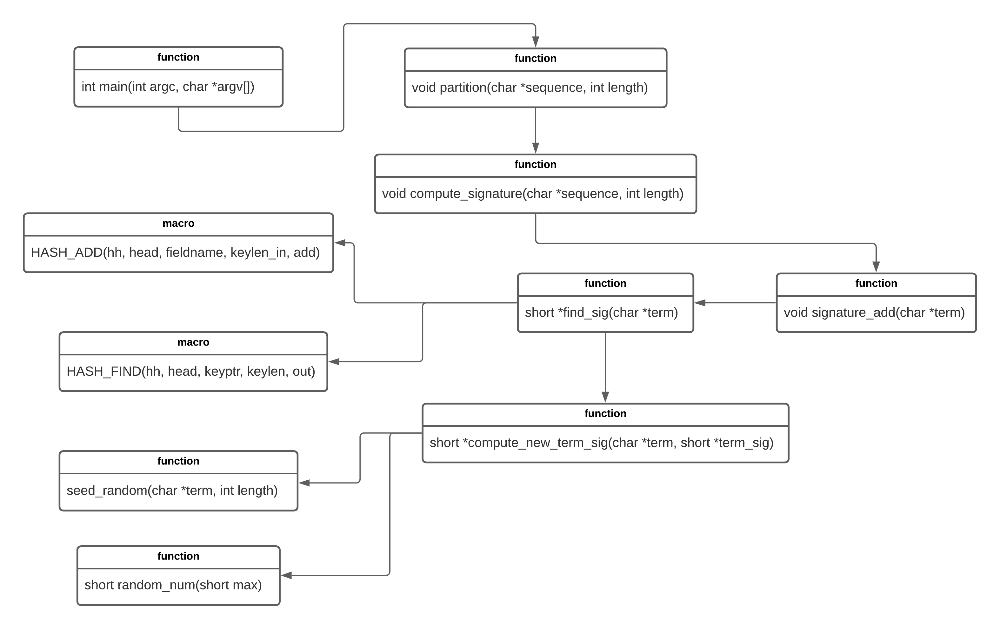
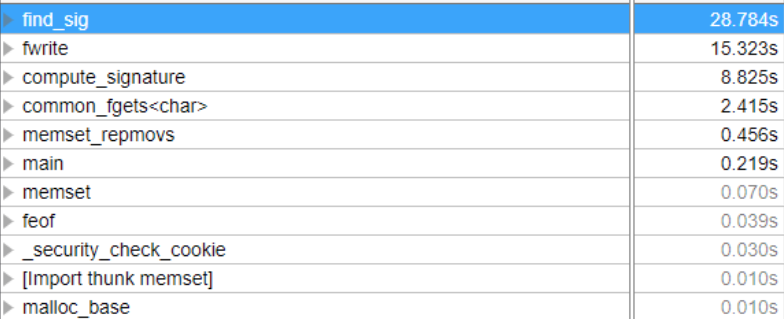
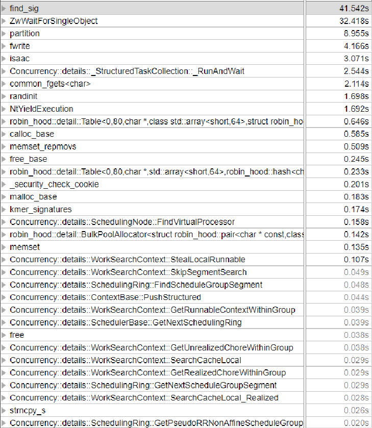
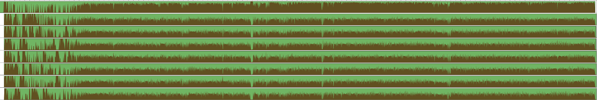
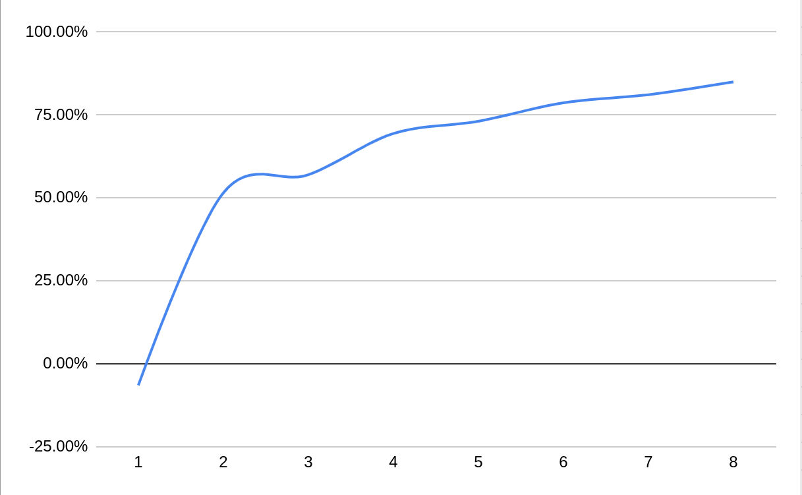

# kmer-signatures

This project was part of my Parallel and High Performance Computing course

# Parallelizing K-mer Signatures

## 1. Introduction

The program I decided to parallelize for my project was k-mer signatures computation software. This program is written in C++ and relates to the field of Computational Genetics. K-mers are short consecutive subsequences of a genomic sequence. They represent certain signatures to describe different genomes or different regions in a sequence. The program takes a `.fasta` file containing sequences and computes a k-mer signature for each sequence and then saves these signatures to a binary file for use later. The frequency of a set of k-mers in a specie's genomic region or class of sequences can be as a "signature" of the underlying sequence. Comparing these frequencies is significantly easier than sequence alignment, which is a way of arranging sequences to identify regions of similarity.

The figure presents an overview of the structure of the application. The `main` function loads the `.fasta` file and creates an output file to write the computed signatures to. The `while` loop reads lines from the file and computes and writes the signatures to output for each sequence. Partition uses `compute_signature` to compute the signature for each partition of the sequence. `compute_signature` uses an array named `doc_sig` to store the signature for the particular partition. The signature is added to the `doc_sig` array by `signature_add`. `signature_add` uses `find_sig` to get the signature and then iterates over the signature to add it to `doc_sig`. `find_sig` uses `compute_new_term_sig` to create a new signature, this computed signature is added to a hashmap so that if the same word appears again the signature does not have to be recomputed and instead can be retrieved from the hashmap.

## 2. Analysis



The kmer-signatures application offers some opportunities to exploit parallelism. The signature for each partition of a sequence can be computed independently, and all the sequences in the file can be worked on independently since there is no data dependencies between them. The only true dependence is that the signatures and document numbers must be written to the file in the same order that the original sequential version of the program writes them in. Unfortunately this requirement does mean that finding scalable parallelism for this application as there is no way to avoid performing the writing of the signatures to the file sequentially. So there was essentially two areas of the program that were exploitable for parallelism. The loop containing `compute_signature` and the main loop containing `partition`. If `compute_signature` was parallelized, writing to the file in order would be trivial and wouldn't require much extra work beyond restructuring the `doc_sig` array and parallelizing the for-loop. I reasoned that trying to exploit parallelism further down the call tree would be too fine grained and have too much overhead to be worthwhile so it seemed that the two opportunities I had decided on were the only ones worth pursuing. Initially both of those options seemed to be of sufficient granularity to be worth exploiting and I attempted the parallelize the `compute_signature` loop first as that would require the least amount of program restructuring and be the simplest.

Global variables at the top of the file. `doc_sig` holds the signature for each partition of a sequence while its been computed and then is written to the `sig_file`.

```C++
int doc_sig[SIGNATURE_LEN];

int WORDLEN;
FILE* sig_file;

typedef struct
{
    char term[100];
    short sig[SIGNATURE_LEN];
    UT_hash_handle hh;
} hash_term;

hash_term* vocab = NULL;

```

The main loop, which iterates through each line of the file and passes the extracted sequence to `partition.

```C++
    char outfile[256];
    sprintf_s(outfile, 256, "%s.part%d_sigs%02d_%d", filename, PARTITION_SIZE, WORDLEN, SIGNATURE_LEN);
    fopen_s(&sig_file, outfile, "w");

    char buffer[10000];
    while (!feof(file))
    {
        fgets(buffer, 10000, file); // skip meta data line
        fgets(buffer, 10000, file);
        int n = (int)strlen(buffer) - 1;
        buffer[n] = 0;
        partition(buffer, n);
    }
```

The partition function, which takes a sequence and passes partitions from it to `compute_signature`.

```C++
void partition(char* sequence, int length)
{
    int i = 0;
    do
    {
        compute_signature(sequence + i, min(PARTITION_SIZE, length - i));
        i += PARTITION_SIZE / 2;
    } while (i + PARTITION_SIZE / 2 < length);
    doc++;
}
```

## 3. Methods

I decided to use the C++ Parallel Patterns Library (PPL) by Microsoft to parallelize my application. PPL is part of the Concurrency Runtime for Visual C++. Choosing to use this library was an easy choice for me as using it was very simple, just requiring to use a `parallel_for` directive to run a for-loop in parallel, for example. Also it is included with Visual Studio by default so did not require any installation. PPL contains a number of abstractions to perform multi-core programming including Task Parallelism, Parallel Algorithms and Parallel containers and objects. There is also other synchronization abstractions included in the libraries. I experimented with the Task Parallelism and Parallel Algorithms functions, and also made use of the `reader_writer_lock` during the process.

The Parallel Patterns library aims to provide a level of abstraction between the application code and the underlying threading mechanism by providing generic, type-safe algorithms and containers that can operate on data in parallel. There is also features that provide alternatives to shared state.

The main feature of the Parallel Patterns Library that I was Parallel Algorithms. These functions provide a further level of abstraction over the Concurrency Runtime. The `concurrency::parallel_for` function I used to perform parallelism uses a `concurrency::structured_task_group` under the hood to do the parallel loop iterations. The `parallel_for` function also attempts to partition work to the available resources in the most efficient and optimal way.

The `parallel_for` algorithm attempts to partition tasks in the most efficient way for parallel execution. It also uses a work-stealing algorithm to balance workloads when they are unbalanced. When one thread's execution is blocked, it redistributes the work from the current thread to other threads which are not blocked. There is also support for nested parallelism, where a loop can go inside another parallel loop and the processing resources will be coordinated to perform this efficiently.

To ensure I was restricting resources to a certain amount of processors while I was conducting testing, I used a Scheduler Instance from the Concurrency Runtime. `concurrency::Scheduler` provides an interface to create explicit scheduling policies. There is a default one created so you do not have to create a scheduler if you don't require specific scheduling configuration. The scheduler instance can set the max amount of concurrency with the create method.

The `reader_writer_lock` class is also part of the Concurrency Runtime. A reader writer lock provides concurrent access for readers but exclusive access for writers. This lock is a writer-preference queue-based reader-writer lock. This type of lock grants first in - first out access to writers and will starve readers under a continuous load of writers.

## 4. Profiling

### Sequential



Profiling results on the sequential program show that the majority of time is spent in the `find_sig` function. Second is `fwrite` which takes up a decent amount of time and also involves costly I/O.

### Parallelized



The updated profile shows that alot of time is still spent in `find_sig`, but less is spent in `fwrite` and CPU time is distributed more evenly to the other functions.



We can see that the threads are utilizing CPU time, but there is many dips, this would be caused by the gaps needed to write the computed signatures to the output file.

### Speedup

#### Timing Testing Results

|            | Sequential | 1           | 2           | 3          | 4          | 5           | 6           | 7         | 8         |
| ---------- | ---------- | ----------- | ----------- | ---------- | ---------- | ----------- | ----------- | --------- | --------- |
|            | 55.961     | 58.049      | 32.269      | 30.261     | 26.558     | 25.246      | 23.446      | 22.73     | 22.53     |
|            | 54.339     | 58.042      | 32.476      | 30.078     | 26.338     | 25.229      | 23.914      | 22.857    | 22.13     |
|            | 54.102     | 57.646      | 31.965      | 30.305     | 26.325     | 24.801      | 23.898      | 23.011    | 21.969    |
|            | 61.932     | 57.939      | 31.911      | 30.133     | 26.226     | 24.934      | 23.335      | 23.172    | 21.85     |
|            | 55.085     | 57.312      | 31.966      | 30.122     | 26.227     | 25.697      | 23.41       | 22.72     | 21.156    |
|            | 55.661     | 58.501      | 32.189      | 30.483     | 26.326     | 25.058      | 23.647      | 23.285    | 22.418    |
|            | 54.098     | 57.816      | 31.935      | 30.207     | 26.396     | 25.441      | 23.644      | 22.93     | 22.089    |
|            | 54.073     | 58.376      | 31.982      | 30.57      | 26.183     | 25.193      | 24.158      | 22.904    | 12.821    |
|            | 54.275     | 58.27       | 33.703      | 30.296     | 26.369     | 27.017      | 23.337      | 23.095    | 21.426    |
|            | 54.136     | 57.488      | 32.167      | 30.029     | 26.354     | 27.497      | 23.919      | 23.01     | 21.865    |
| **Median** | **54.307** | **57.9905** | **32.0745** | **30.234** | **26.332** | **25.2375** | **23.6455** | **22.97** | **21.92** |

### Speedup Testing Results

| Threads | % Speedup |
| ------- | --------- |
| 1       | -6.56%    |
| 2       | 51.48%    |
| 3       | 56.95%    |
| 4       | 69.38%    |
| 5       | 73.09%    |
| 6       | 78.67%    |
| 7       | 81.10%    |
| 8       | 84.98%    |

### Speedup Graph



## 5. Testing

To ensure that the results of my parallelism attempts produced the correct output, I first used the sequential version to generate output files for each of my two test files. I did this with both Debug and Release modes in Visual Studio. Once this was done, I used a function to compare the output file of my parallelized code against the version of the output file from the sequential version. This function was relatively straightforward and compares each file byte by byte and returns with an error and message if the files do not match. This function was especially useful because it informs where and what the files differ in and this made debugging easier. The credit for the function goes to a [Stackoverflow answer](https://stackoverflow.com/a/60571256)

```C++
int compare_files(const char *filename1, const char *filename2) {

    FILE* file1, *file2;

    fopen_s(&file1, filename1, "r");
    fopen_s(&file2, filename2, "r");

    unsigned long pos;
    int c1, c2;
    for (pos = 0;; pos++) {
        c1 = getc(file1);
        c2 = getc(file2);
        if (c1 != c2 || c1 == EOF)
            break;
    }
    if (c1 == c2) {
        return 0;  // files are identical
    }
    else
        if (c1 == EOF) {
            printf("file1 is included in file2, the first %lu bytes are identical\n", pos);
            return 1;
        }
        else
            if (c2 == EOF) {
                printf("file2 is included in file1, the first %lu bytes are identical\n", pos);
                return 2;
            }
            else {
                printf("file1 and file2 differ at position %lu: %u <>%u\n", pos, c1, c2);
                return 3;
            }
}
```

## 6. Tools

My primary tool was the Visual Studio IDE which is excellent for developing with C++. It has a compiler, debugger and profiler which was all I required for this project. I briefly used the Intel VTune Profiler too which offered some more information that Visual Studio did not such as CPU spin time. I used my Dell XPS 13 laptop, running Windows 10.

### Software

- Visual Studio 2019 IDE

  - Developed by Microsoft
  - Support for C# and C++
  - Available for Windows
  - Includes compilers for C# and C++
  - Includes debuggers and profilers
  - Integration with other third-party tools is available

- C++ on Windows with Visual Studio

  - Developed with C++ on Windows using Visual Studio
  - Modern C++, can use C++11, C++14 and C++17
  - Has basic debugging features such as breakpoints and stepping through code but also more advanced features like variable visualisation, performance profiling and multi-threaded debugging

- Intel VTune Profiler

  - Application for software performance analysis
  - Support for C, C++, C#, Fortran, Java, Python, Go and Assembly
  - Can be integrated with Visual Studio
  - Available on Windows and many Linux distributions
  - Has threading analysis for OpenMP, Intel Threading Building Blocks (Which PPL is built on top of)

- Parallel Patterns Library
  - Provides a programming model for scalability and ease-of-use for developing concurrent applications.

### Hardware

- Dell XPS 13
  - Intel Core i7-8550U 1.8GHz x 8 (4 Physical Cores, 8 Virtual Cores)
  - L1 Data: 4 x 32 KBytes 8-way
  - L1 Instr: 4 x 32 KBytes 8-way
  - L2: 4 x 256 Bytes 4-way
  - L3: 8MB 16-Way
  - Memory: 8GB LLDR3
  - Intel UHD Graphics 620 (KBL GT2)

## 7. Process

Initially I attempted to parallelize the loop containing `compute_signature` and did this by restructuring the `doc_sig` array to be a matrix represented by a 1 dimensional array. Then I parallelized the loop with a `parallel_for` directive. After the loop was completed, the resulting `doc_sig` array would be written to the signature file.

```C++
void compute_signature(char* sequence, int length, int* doc_sigs, int row)
{
	int n = (length - WORDLEN + 1);
	int m = SIGNATURE_LEN;
	short* term_sigs = (short*)calloc((n * m), sizeof(short));

	for (int i = 0;i < length - WORDLEN + 1; i++) {
		find_sig(sequence + i, term_sigs, i, m);
	};

	for (int i = 0; i < length - WORDLEN + 1; i++) {
		for (int j = 0; j < SIGNATURE_LEN; j++) {
			doc_sigs[row * SIGNATURE_LEN + j] += term_sigs[i * m + j];
		}
	}

	free(term_sigs);
}

void partition(char* sequence, int length)
{
	int row = 0;
	int* doc_sigs = (int*)calloc(((length - 1) / (PARTITION_SIZE / 2) * SIGNATURE_LEN), sizeof(int));

	int size = (length - 1) / (PARTITION_SIZE / 2);

	parallel_for(int(0), size, [&](int i) {
		int increment = i * (PARTITION_SIZE / 2);
		compute_signature(sequence + increment, min(PARTITION_SIZE, length - increment), doc_sigs, i);
		row++;
	});
	//}

	for (int i = 0; i * (PARTITION_SIZE / 2) + PARTITION_SIZE / 2 < length; i++) {
		// save document number to sig file
		fwrite(&doc, sizeof(int), 1, sig_file);

		for (int l = 0; l < SIGNATURE_LEN; l += 8) {
			byte c = 0;
			for (int j = 0; j < 8; j++)
			{
				c |= (doc_sigs[(i * SIGNATURE_LEN + l) + j] > 0) << (7 - j);
			}
			fwrite(&c, sizeof(byte), 1, sig_file);
		}
	}

	doc++;
	free(doc_sigs);
}
```

However the resulting program was far slower than even the sequential one due to the parallel overheads and I decided not to spend much more time on this approach. Maybe it should've been more obvious to more that attempting to exploit fine grained parallelism like this was not going to give me the results I wanted but hindsight is 20/20.

So I abandoned the idea of parallelizing the loop with `compute_signature` and moved up the call tree and focused my attention on parallelizing the loop containing `partition`. To parallelize this loop, I realized that I'd need to compute the signatures in batches, and then write the results to the file sequentially, this parallelism was much coarser grained than my first attempt so I was confident that I would achieve a decent speedup with this method. To control thread-safe access to the hashmap, I implemented a reader-writer lock on it. This type of lock allows readers to make concurrent access to the hashmap, but when a writer acquires the lock, they will have exclusive access. This method of synchronization seemed promising as threads reading the hashmap would be far more likely than threads writing to the hashmap. After implementing this and testing, I found that it was still slower than the sequential version. Profiling with the Intel VTune Profiler revealed that the threads were spending lots of time waiting for the locks and was completely killing any chance of a speedup.

At this point I started to wonder whether switching to a different library was the answer and spent a bit of time researching PPL vs other libraries. Eventually I reasoned that Microsoft probably knows how to develop a good parallel computing library and the problem was with my code. The root of the problem now was the locks being nested in double iteration for each sequence, all of the threads were acquiring the lock many times and all of this excessive locking was killing the performance of my program. I tested just ditching the hashmap altogether and computing the signature each time but this was extremely slow so I could confirm that I did need the hashmap for performance. The problem become how do I avoid locking and avoid computing the signature every time. The answer was a thread-local hashmap. Each thread would have its own hashmap which would mean no locking was required and no thread would have to compute a signature for a sequence partition that they had already seen. This gave me the speedup I was looking for and was a huge improvement over my previous parallelism attempts.

After profiling my new code again, I discovered two areas that were taking up a significant amount of execution time that could be optimized. My method of processing sequences in parallel batches and then writing the results sequentially also gave me the opportunity to optimize writing the output to a file. Since all of the signatures were already computed, I was able to optimize the loop containing `fwrite` to write the computed signatures in chunks of 8 bytes, with a gap to write the document number. This meant I could avoid costly file I/O and thus improved the speed. There was also a decent chunk of CPU time spent find the signature in the hashmap, I was using `std::unordered_map` and had rightfully assumed it was reasonabally fast but I researched other hashmap implementations and came across a number that claimed to be faster than the standard library. I came across this post on a C++ forum (included in references) and since using the library was as simple as pasting the header file into my project I decided to use it. I'm sure that performing more research and testing could've yielded a greater improvement but using `robin_hood::unordered_map` instead of the standard library gave me another decent speed boost so I was satisfied with that.

But while I was achieving a speedup over the sequential with my new version of the code, the program was not responding to extra cores and thus the parallelism was not scalable. My tests were showing that while the new program was faster than the sequential version, it was not increasing in speed when more resources where allocated to the program. After profiling my code again, I discovered that lots of time was spent forking and joining the threads, and also threads waiting for other threads to complete their work. The program was reading sequences and computing the signatures in chunks of 8, and such a small amount of work was causing the overheads to eat up lots of CPU time, and would also mean that threads were almost certainly going to be waiting on other threads to complete their work before the `parallel_for` loop could exit. I experimented a bit and found that increasing the chunk size to 2000 yielded a much greater response to more resources than the previous chunk size of 8.

## 8. Source Code Explanation

The code sample below demonstrates how the main while loop was modified to read sequences from the input file in chunks and then uses a `parallel_for` to process the extracted sequences in parallel. `CHUNKS` is set to 2000. The `fwrite` parts have also been modified to write in series of 8, because it is more efficient to write to disk once instead of 8 separate times.

```C++
	sigs = (byte**)malloc(sizeof(byte*) * CHUNKS);

	while (!feof(file))
	{
		int work = 0;
		while (work < CHUNKS && !feof(file)) {
			fgets(buffer[work], 10000, file); // skip meta data line
			fgets(buffer[work], 10000, file);
			int n = (int)strlen(buffer[work]) - 1;
			lengths[work] = n;
			buffer[work][n] = 0;
			work++;
		}

		concurrency::parallel_for(int(0), work, [&](int i) {
			sizes[i] = partition(buffer[i], lengths[i], i);
		}, concurrency::static_partitioner());

		for (int i = 0; i < work; i++) {
			for (int j = 0; j < sizes[i];j += 8) {
				fwrite(&doc, sizeof(int), 1, sig_file);
				fwrite(&sigs[i][j], sizeof(byte), 8, sig_file);
			}
			doc++;
			free(sigs[i]);
		}
	}
```

The partition function remained largely unchanged, except for allocating memory to the `sigs` sub-array and incrementing the signature array index. It also returns the size of the signature array so that the main function knows how long the signature to write is.

```C++
int partition(char * sequence, int length, int x)
{
	int size = ((length - 1) / (PARTITION_SIZE / 2)) * SIGNATURE_LEN / 8;

	sigs[x] = (byte*)calloc(size, sizeof(byte));

	int si = 0;
	int i = 0;
	do
	{
		compute_signature(sequence + i, min(PARTITION_SIZE, length - i), x, si);
		i += PARTITION_SIZE / 2;
		si += (SIGNATURE_LEN / 8);
	} while (i + PARTITION_SIZE / 2 < length);

	return size;
}
```

The `compute_signature` function also only required some minor changes, I had to remove `doc_sig` as a global variable and make it a local one.

```C++
void compute_signature(char* sequence, int length, int x, int n)
{
	int doc_sig[SIGNATURE_LEN];
	memset(doc_sig, 0, sizeof(doc_sig));

	for (int i = 0; i < length - WORDLEN + 1; i++)
	{
		signature_add(sequence + i, doc_sig);
	}

	// flatten and output to sig file
	for (int i = 0; i < SIGNATURE_LEN; i += 8)
	{
		sigs[x][n] = 0;
		for (int j = 0; j < 8; j++) {
			sigs[x][n] |= (doc_sig[i + j] > 0) << (7 - j);
		}
		n++;
	}
}
```

The structure of `signature_add` was not changed notably, however I was able to change `find_sig` significantly because I used a different hashmap and `typedef`'s for computed signatures to make writing code simpler.

```C++
computed_sig find_sig(char* term)
{
	auto item = sig_map.find(term);
	if (item != sig_map.end())
	{
		return item->second;
	}

	computed_sig new_sig = computed_sig();
	compute_new_term_sig(term, new_sig);
	auto new_item = sig_map.insert({ term, new_sig });

	return new_item.first->second;
}
```

Previously there was a global hashmap using `uthash` but I switched to `robin-hood`() and made the hashmap's `thread_local` instead.

```C++
thread_local robin_hood::unordered_map<char*, computed_sig> sig_map;
```

I also had to modify the `compute_new_term_sig` and `seed_random` functions to allow for multi-threading. Mainly this was moving variables out of global scope into local. `seed_random` now returns a random context and `random_num` accepts this context as a parameter, instead of storing in global scope, so that multiple threads can use these functions at once.

```C++
randctx* seed_random(char* term, int length)
{
    randctx* R = (randctx*)malloc(sizeof(randctx));
    memset(R->randrsl, 0, sizeof(R->randrsl));
    strncpy_s((char*)(R->randrsl), sizeof(R->randrsl), term, length);
    randinit(R, TRUE);
    return R;
}

short random_num(short max, randctx* R)
{
    return rand(R) % max;
}
```

## 9. Reflection

This project has been a great learning experience. I have learned a great deal about parallel computing and C++ programming. Before starting this project and in the beginning of the unit, I falsely assumed that the overheads of parallel programming were minimal and that easy speed gains could be achieved if only one could structure their program in a way that would make it easy for parallel execution. I didn't consider that the amount of work being performed in parallel is paramount to achieving a decent speedup and not just wasting the overhead of creating and managing threads to perform a small amount of work, this assumption was partly why my first attempts at parallelization were unsuccessful. I also learned that you cannot make assumptions about how code is performing, except in very obvious cases, but profiling is the best way to determine how code is actually performing and how effective your attempts at improving it are.

I also learned that synchronization methods like mutexes and critical section locks have a large overhead and careful consideration needs to be made when using them. It is important that you consider all the ways of restructuring your program to make it parallel, and move your thinking away from the sequential way of writing the program. When I decided that thread local hashmap was the answer over a shared one I realized that the benefits of not having to lock were greater than the benefit of not potentially computing the same sequence multiple times.

I learned that choice of library can be important. Ultimately choosing a decent and well-known library like Microsoft's PPL was a good choice and changing libraries is probably a bad idea and not going to yield any benefits. Performing adequate research and finding that there wouldn't be much difference between PPL and other parallel libraries allowed me to make the right choice. However, after researching and discovering that some hashmap implementations are better than `std::unordered_map` gave a decent speedup. The benchmarks that the author of the `robin_hood` library gave me reasonable confidence that using `robin_hood::unordered_map` would be faster. Also since using the library was just including a header file it meant that I had to spend very little development time for a decent gain.

Overall I would say that my attempt to parallel the application was successful but I think that this is not the best possible speedup that could've been achieved. If I were to start again I would immediately focus on parallelizing coarser grained work rather than focusing on fine grained, even if attempting to parallelize that seems to be easier at a first glance. I would also consider that locking is very expensive and determining if thread synchronization is actually needed would be my first approach, not just implementing locks. I also realized too late that I had just assumed that I needed to process the sequences in batches. I thought that all the computed signatures would be too big to hold in memory to just read all the sequences from the `.fasta` file, compute all signatures and then write them at the end. I also could've explored modeling the problem around producer-consumer, having one thread reading and writing and others processing, but this might've been extremely complex.

## 10. Compilation Instructions

My submission contains a Git repository which two branches for the sequential and parallel versions of my program. There is an additional branch that contains a failed attempt at parallelizing. Ideally this project should be run with Visual Studio which will be the easiest way to get started. Using the `.fasta` file and the sequential version of the program, you can generate a signature file to test the parallel version of the program with. `qut2.fasta` is smaller than `qut3.fasta` and will process quicker. Once you have this test file generated, rename to `test_qut3.fasta.part16_sigs03_64` and have this file-name as the value of `test_file` in the `kmer_signatures` method. Make sure that you run the parallel version of the program in the same mode (e.g. Debug or Release) as you ran the sequential version so the results are the same. In `main` you can change the amount of threads you want to run the parallel version with. Ensure that the `.fasta` files are in the correct directory.
